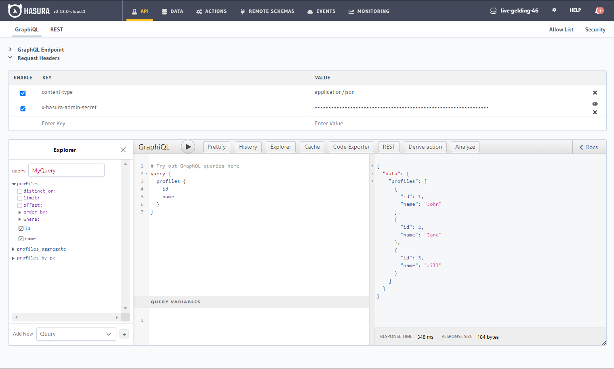

# Hasura CI/CD pipeline

Deploy Hasura server with CI/CD on Elestio

 
 

# Once deployed ...

You can open Hasura UI here:

    URL: https://[CI_CD_DOMAIN]
    password: [ADMIN_PASSWORD]

## More informations <a target="_blank" href="https://hasura.io/docs/latest/index/">here</a>
